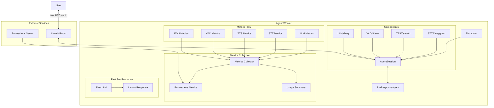
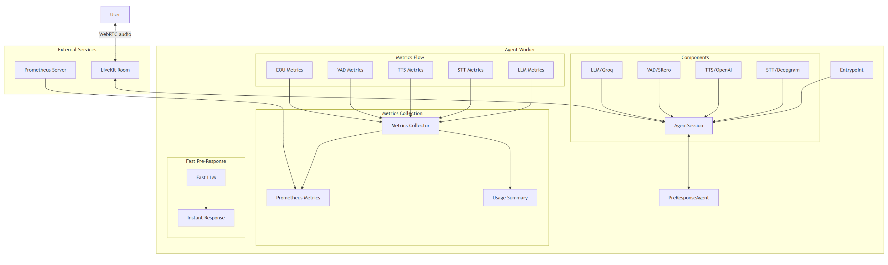

# agent-worker

A real-time voice agent implementation using LiveKit, featuring fast pre-response capabilities and comprehensive metrics collection. Here we implement the logic for the voice AI worker to explore different functions:
- fast-preresponse.py

This example uses Llama 3.1 8B and 70B. Initial quick response comes from 8B to optimize latency, and then the 70B takes over to handle the complex task.
- fast-preresponse-ollama.py

Same idea but using Ollama instead of Groq

## Run with Docker

1. Build the Docker image:
```bash
docker build -t agent-worker .
```

2. Create a `.env` file with your API keys like in .env.example

3. Run the container:
```bash
docker run --env-file .env -p 9100:9100 agent-worker
```

## Run without Docker with conda

1. Create and activate a conda environment:
```bash
conda create -n agent-worker python=3.10
conda activate agent-worker
```

2. Install dependencies:
```bash
pip install -r requirements.txt
```

3. Create a `.env` file with your API keys (same as Docker setup)

4. Run the agent:
```bash
python fast-preresponse.py
```


## Architecture





## Components

- **PreResponseAgent**: Main agent implementation with fast pre-response capabilities
- **Metrics Collection**: Comprehensive metrics tracking for:
  - LLM usage and latency
  - STT processing
  - TTS generation
  - VAD detection
  - End-of-utterance detection
  - Cost tracking
- **Fast Pre-Response**: Quick acknowledgment system using a smaller LLM model

## Metrics

The agent collects and exposes the following metrics:

- **Latency Metrics**:
  - LLM processing time
  - STT processing time
  - TTS generation time
  - End-of-utterance delay
  - Total conversation latency

- **Usage Metrics**:
  - LLM tokens (prompt and completion)
  - STT audio duration
  - TTS character count
  - Total tokens processed

- **Cost Metrics**:
  - LLM usage costs
  - STT processing costs
  - TTS generation costs
  - Total costs