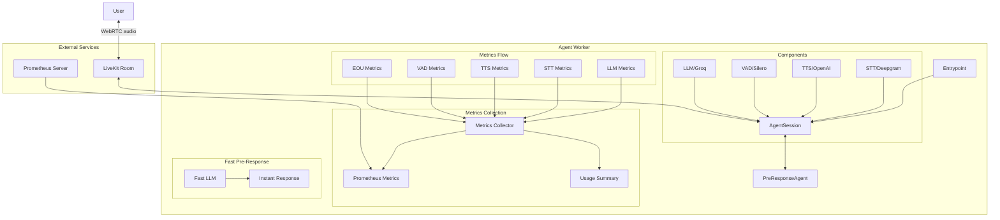

# agent-worker

A real-time voice agent implementation using LiveKit, featuring fast pre-response capabilities and comprehensive metrics collection. Here we implement the logic for the voice AI worker to explore different functions:
- fast-preresponse.py

This example uses Llama 3.1 8B and 70B. Initial quick response comes from 8B to optimize latency, and then the 70B takes over to handle the complex task.
- fast-preresponse-ollama.py

Same idea but using Ollama instead of Groq

## Run with Docker

1. Build the Docker image:
```bash
docker build -t agent-worker .
```

2. Create a `.env` file with your API keys like in .env.example

3. Run the container:
```bash
docker run --env-file .env -p 9100:9100 agent-worker
```

## Run without Docker with conda

1. Create and activate a conda environment:
```bash
conda create -n agent-worker python=3.10
conda activate agent-worker
```

2. Install dependencies:
```bash
pip install -r requirements.txt
```

3. Create a `.env` file with your API keys (same as Docker setup)

4. Run the agent:
```bash
python fast-preresponse.py
```


## Architecture




## Components

- **PreResponseAgent**: Main agent implementation with fast pre-response capabilities
- **Metrics Collection**: Comprehensive metrics tracking for:
  - LLM usage and latency
  - STT processing
  - TTS generation
  - VAD detection
  - End-of-utterance detection
  - Cost tracking
- **Fast Pre-Response**: Quick acknowledgment system using a smaller LLM model

## Metrics

The agent collects and exposes the following metrics:

- **Latency Metrics** (Gauge):
  - `livekit_llm_duration_ms`: LLM processing time in milliseconds
  - `livekit_stt_duration_ms`: STT processing time in milliseconds
  - `livekit_tts_duration_ms`: TTS generation time in milliseconds
  - `livekit_eou_delay_ms`: End-of-utterance delay in milliseconds
  - `livekit_total_conversation_latency_ms`: Total conversation latency in milliseconds

- **Usage Metrics** (Counter):
  - `livekit_llm_tokens_total`: Total LLM tokens processed (prompt and completion)
  - `livekit_stt_duration_seconds_total`: Total STT audio duration in seconds
  - `livekit_tts_chars_total`: Total TTS characters processed
  - `livekit_total_tokens_total`: Total tokens processed
  - `livekit_conversation_turns_total`: Number of conversation turns
  - `livekit_active_conversations`: Number of active conversations

- **Cost Metrics** (Gauge):
  - `livekit_llm_cost_total`: Total LLM cost in USD
    - Prompt tokens: $0.01 per 1K tokens
    - Completion tokens: $0.03 per 1K tokens
  - `livekit_stt_cost_total`: Total STT cost in USD
    - $0.0001 per second of audio
  - `livekit_tts_cost_total`: Total TTS cost in USD
    - $0.000015 per character

All metrics are collected using Prometheus client library and are exposed through the agent-metrics service. The metrics are collected in real-time and updated as the conversation progresses.

Note: Usage metrics are implemented as Counters to track cumulative usage, while latency and cost metrics are implemented as Gauges to show current values.
